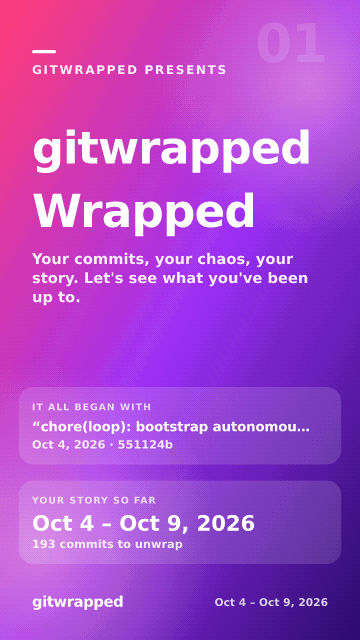

# gitwrapped

[](https://github.com/furkycl/gitwrapped/actions/workflows/ci.yml)

**Spotify Wrapped, but for your git history.** Run one command in any repo and get a
set of shareable story cards. Everything runs locally, and you don't need an API key.

```bash
npx @furkycl/gitwrapped
```

<p align="center">
  
</p>

See gitwrapped's own Wrapped: [docs/self-wrapped/](docs/self-wrapped/) has the cards from
running it on this repo, plus the 1200x630 [`share.png`](docs/self-wrapped/share.png)
summary image it made for link previews.

## What you get

Ten 1080x1920 story cards, plus a monthly timeline when your commits span two or more
calendar months and a team card in a repo with more than one contributor (up to twelve):

1. **Intro**: the repo name, the date range in plain English ("Oct 4 – Oct 5, 2026") and how many commits there are to unwrap, plus whose story it is when you pass `--author` (the part of the email before the `@` only: "Starring ada."), and where it all began: an "It all began with" panel with the first commit in the window, its quoted subject on one line ("“Initial commit”") and its day and short hash below ("Jan 3, 2025 · 1a2b3c4"; with several repos, its repo too). Merge commits are skipped. The subject is shortened to fit its line (first a smaller font, then cut with "…"), a long repo label is cut with "…" so the day and hash always show, and when the card has no room for the panel it is left out (it is still in the recap, `wrapped.md` and `stats.json`).
2. **Totals**: commits, a lines added vs. removed bar, active days and files touched (and contributors, when there is more than one), plus your commit size mix: the share of tiny (under 10 lines), small (10–99), medium (100–500) and large (over 500 lines changed) commits as one stacked bar. The bar only uses spare room: when the card is short of space (with `--year`'s three extra rows, say) it is left out, and nothing else on the card shrinks for it (the mix is still in the recap and `stats.json`). Sizes count the same files as hot files (lockfiles, build output and the rest are left out, and so is anything you `--exclude`) and skip merge commits. When some of your commits were paired (a `Co-authored-by:` trailer, see the team card) and the team card is not there to show it (or has no room for it, or you passed `--author`), a "Paired (top: Ada)" row with their count is added, again only when it fits without anything else shrinking. After it, when files were added or deleted in the window, a "Born / buried 12 / 3" row follows on the same terms (spare room only; it never takes the place of the pairing row or anything else, and it is always in the recap, `wrapped.md` and `stats.json`).
3. **Power hour**: the hour of the day you commit the most, with a 24-hour bar chart and a Monday-to-Sunday weekday chart (hover a bar in `wrapped.html` for its count). Hours are each commit's own local time. When your commits came from two or more time zones (UTC offsets), the card always says so, in the first of these that fits: "Committed from 3 time zones, mostly UTC+03:00." at the end of the subtitle, or a "3 time zones · mostly UTC+03:00" row (both charts kept, the big number at most one step smaller); else the sentence takes the place of the hour's quip, then of the quip and the busiest-weekday sentence (the hour's sentence always stays). "mostly" is left out when two offsets tie. With a single time zone the card is unchanged.
4. **Streak**: your longest run of consecutive days with a commit, with a longest vs. current bar comparison and your longest break (the most days without a commit between two active days) when you took one. With two or more active days, a "2.4 per active day  every 3 days" row adds your cadence (commits per active day and the median gap between your active days, "every day" when it is 1), only when there is room for it: the same charts and panels drawn, the big number, text and bars at their usual size (the bar chart may give up some spare spacing between its bars) and the row shown whole; otherwise the card is exactly as before (the cadence is always in the recap, `wrapped.md` and `stats.json`).
5. **Activity**: a GitHub-style calendar of commits per day (weeks as rows, Monday to Sunday, brighter the busier the day), with your number of active days and your busiest day. Hover a day in `wrapped.html` for its count. It covers up to the last 53 weeks of your history, and so does its busiest day: on a history longer than about a year it is the busiest day of the weeks on the grid, while the recap, `wrapped.md` and `stats.json` give the busiest day of the whole window. For a repo that went quiet more than a month ago it says "12 months to Apr 2021" instead of "Your last 12 months". When you made at least one weekend commit and the grid shows your whole history (no more than 53 weeks, nothing dated in the future), a "Weekends  12 commits · 8%" row adds how many commits landed on a Saturday or Sunday (author-local), only when there is room for it: the calendar's cells may get smaller to make room, but never below their normal minimum size, and nothing else shrinks; otherwise the card is exactly as before.
6. **Month by month** (only when your commits span two or more calendar months): commits per month as a bar chart, from your first active month to your last (months without commits show as empty bars), with the peak month among the months shown called out ("Mar 2026 was your peak month"; a tie goes to the earliest month, and when every active month has the same count it says so instead) and how many of those months had commits. It shows your most recent 24 months at most ("Your last 24 months", or "24 months to Apr 2019" for a repo that went quiet more than a month ago, like the activity card); `stats.json` keeps every month, and its `peak` is over all of them. Months are the author's own calendar months, like the activity calendar, and commits dated after tomorrow are left off. A history inside one calendar month skips this card, and the cards after it then move up a number.
7. **Hot files**: the five files you edit most as a bar list. Lockfiles, build output (`dist/`, `build/`, ...), dependency folders, vendored code (a root `vendor/` or `third_party/`), minified files and test snapshots (`*.snap`, `__snapshots__/`) are ignored. When your changes span two or more top-level folders, a small "Top folders" list follows: the three (else two) folders with the most lines changed, files at the repo root shown as "(root)". It only uses spare room: the hot-files list (and, with several repos, the per-repo chart) keeps every bar at full size (the big file name may get one step smaller), and when it doesn't fit the card is exactly as before (the folders are still in the recap, `wrapped.md` and `stats.json`).
8. **Languages**: your top programming language and its share of the lines you changed ("72% · Mostly TypeScript", or "Led by" under half, with ties named), with bars for your top five languages plus "Other". Data formats (JSON, YAML, ...) and prose (Markdown, ...) show in the bars, but they only lead the card when there's no code at all. Languages come from file extensions and well-known names like `Dockerfile` and `Makefile` (86 built in); lockfiles, build output, vendored code, test snapshots and binary files are left out, as for hot files.
9. **The team** (only when the history has two or more contributors): how many people committed and the top five by commits as bars ("Ada Lovelace leads the pack with 54% of the commits"). With `--author` it ranks you against everyone in the same window: "#2 of 7 contributors", your share of the commits and lines, and a "you" marker on your bar (a sixth bar when you're outside the top five). Contributors are counted per email after `.mailmap`, and only their git author names are shown, never an email. A single-author repo skips this card, and so does an `--author` with no commits in the window (there's no "you" to rank); the cards after it then move up a number. When commits carry `Co-authored-by:` trailers (pair programming, GitHub's co-authored commits, AI assistants), a "Pair programming" panel follows the bars: "12 commits paired" and the top co-author by name ("Top co-author: Grace Hopper"). A commit counts as paired when it lists at least one co-author other than its own author; merge commits are skipped. Co-authors go through `.mailmap` like authors and are shown by name only, never an email. The panel only uses spare room: when it doesn't fit, the card is exactly as without it and the totals card gets a row instead (when that fits); either way the pairing is in the recap, `wrapped.md` and `stats.json`. With `--author` the pairing counts only your commits (a commit where you are only a co-author does not count), so it goes on the totals card, not on the team card, which is everyone's.
10. **Message hall of fame**: your favorite word, your longest and shortest messages, and how many "fix", "wip" and "oops" commits you made, plus your biggest commit: the one with the most lines changed, with its day, lines added / removed and subject. It counts the same files as hot files (lockfiles, build output and the rest are left out, and so is anything you `--exclude`) and skips merge commits; a tie goes to the earliest commit. When at least 20% of your commits follow [Conventional Commits](https://www.conventionalcommits.org/) (`feat: ...`, `fix(api)!: ...`), the card also shows your commit type mix as a thin stacked bar: the top three types and any others folded into "the rest", each with its share of those commits, and the share of commits that follow the convention in its caption. When you only ever use one type, the bar sets it against the commits without a prefix ("no prefix"), as shares of all commits; with a single type on every commit there is nothing to compare and no bar. The bar only uses spare room; when there isn't enough, the fix / wip / oops counts are folded into one row ("“fix” / “wip” / “oops”: 5 / 0 / 2") to make room, and when it still doesn't fit, the card is left as it was (the mix is still in the recap, `wrapped.md` and `stats.json`). When at least 5% of your commits have an emoji in the subject (a Unicode emoji like ✨ or a [gitmoji](https://gitmoji.dev) shortcode like `:sparkles:`), the card also gets an emoji row: your top three emoji and the share of commits with one ("Emoji ✨ 🐛 📝 · 12%"). It never costs the type mix or the biggest commit their room: it goes after the other rows when there's spare room, else the fix / wip / oops counts are folded into one row to make room (the big word may also get one step smaller), and when even that doesn't fit, it takes the place of the fix / wip / oops row (those counts stay in `stats.json`). When some of your commits revert another (a `Revert "…"` subject or a conventional `revert: …` one, or a line starting "This reverts commit <hash>" in the message, as `git revert` writes), the card also gets a "Reverts" row with their count and share of your non-merge commits ("Reverts 3 · 2%"), as its last row (after the emoji row). It only uses spare room: it goes after the other rows, else the fix / wip / oops counts are folded into one row to make room (the big word may also get one step smaller); it never takes the place of the fix / wip / oops row, the type mix or the biggest commit, so when it doesn't fit it is left off the card (the reverts are still in the recap, `wrapped.md` and `stats.json`). Without reverts the card is exactly as before.
11. **Personality**: Night Owl, Early Bird, Friday Deployer, Fixaholic, Weekend Warrior or Steady Shipper, with a one-line roast and bars for your top habit scores. A Fixaholic's reason also counts your reverts, when you have any ("62% of your commit messages are fixes; 3 commits revert another.").
12. **Outro**: a summary card to post: commits, power hour, best streak and personality tiles, plus your hottest file. When tags point at commits in the window (your releases: one per tagged commit, see `stats.releases` below), a "Releases" panel follows: "You shipped 3 releases" and the latest one with its day ("Latest: v1.5.0 · Oct 6, 2026"; a long tag name is cut in the middle with "…", so its start, its version at the end and the day always show). To make room for it the subtitle gives way, and nothing else shrinks: first the "Made with gitwrapped" line goes, then, with `--year`, the comparison with the year before (it is still on the totals card and in the recap). Without tags the card is exactly as before.

You also get:

- **`wrapped.html`**: one self-contained story viewer that works offline and from `file://`.
  It shows story-style progress bars. Tap or click the right side (or press → or Space)
  to go forward, and the left side (or ←) to go back. Home and End jump to the first and
  last card, and you can swipe on touch screens. To pause auto-advance, press and hold
  the card, use the pause button, or press P or K. You can link to a card with
  `wrapped.html#3`. Auto-advance is off when your system prefers reduced motion.
  A toolbar under the story shows which card you're on (for example `3 / 11`) and saves the
  current card. **PNG** (or press D) downloads it as a 1080x1920 `NN-<card>.png`, drawn
  in your browser. If the browser can't draw it, you get the SVG instead. **SVG**
  downloads `NN-<card>.svg`. **Share** appears only where the browser supports the
  system share sheet. It shares the PNG when it can, and otherwise the title text, never
  a link. Press **?** (or the ? button) for the list of keyboard shortcuts. Single-key
  shortcuts never fire with Ctrl, Alt or Cmd held, or while typing in a text field.
  Screen readers get each card's content as text too (its headline, numbers and lists).
- **PNGs**: each card as a 1080x1920 PNG, plus a 1200x630 `share.png` summary for link
  previews and social posts.
- **Terminal recap**: commits, active days, lines, power hour, busiest day of the
  whole window (e.g. `Busiest day  Oct 2, 2026 (14 commits)`), time zones (with two or
  more UTC offsets, e.g. `Time zones  3 time zones · mostly UTC+03:00 (62% of commits)`),
  weekend commits (with at least one, e.g. `Weekends  12 commits (8% of commits)`),
  streak, longest break, cadence (with two or more active days, e.g.
  `Cadence  2.4 commits per active day · every 3 days`),
  hottest file, top folders (with two or more, e.g.
  `Top folders  src/ (1,234 lines) · test/ (567 lines) · (root) (89 lines)`),
  files born / buried (files added and deleted, e.g. `Files  12 born · 3 buried`),
  top language, first commit, team (in a repo with more than one contributor: the top contributor, or
  with `--author` your rank, e.g. `Team  7 contributors · you're #2 (31% of commits)`),
  pairing (when commits have `Co-authored-by:` trailers, e.g.
  `Paired  12 commits (31% of non-merge commits) · top co-author: Grace Hopper`),
  releases (when tags point at commits in the window, e.g.
  `Releases  3 releases · latest: v1.5.0 (Oct 6, 2026)`),
  top word, biggest commit, commit size mix, commit type mix (when you use Conventional
  Commits, e.g. `Types  60% feat · 30% fix · 10% other (85% of commits conventional)`),
  emoji (when at least 5% of the commits have one, e.g.
  `Emoji  12% of commits · ✨ 40 · 🐛 22 · 📝 9`), reverts (when any commit reverts
  another, e.g. `Reverts  3 commits (2% of non-merge commits)`) and personality, printed
  right after the run.
- **JSON** (optional, `--json`): every computed stat in `stats.json`, for your own
  dashboards and scripts.
- **Markdown** (optional, `--md`): a `wrapped.md` summary to paste into a README or a PR
  description (see [Markdown summary](#markdown-summary)).

```
gitwrapped-out/
  wrapped.html          # the story: open it in any browser
  cards/01-intro.svg    # 01-intro … 10-outro (up to 12-outro with the months / team cards), 1080x1920 SVG
  png/01-intro.png      # the same cards as PNG, ready to post
  share.png             # 1200x630 summary image
  share.svg             # the same summary as SVG
  stats.json            # only with --json: every stat as JSON
  wrapped.md            # only with --md: a Markdown summary linking the card SVGs
```

## Install

```bash
npx @furkycl/gitwrapped        # run without installing
npm i -g @furkycl/gitwrapped   # or install the `gitwrapped` command globally
```

The package is published under the `@furkycl` scope. The unscoped `gitwrapped` package
on npm is a different project. Either way, the installed command is `gitwrapped`.

Requirements:

- **Node.js >= 20**
- **`git`** on your PATH
- PNG export uses [`@resvg/resvg-js`](https://github.com/yisibl/resvg-js), a prebuilt
  native module and the only dependency. If no prebuilt binary is available for your
  platform, gitwrapped prints `PNG export skipped: <reason>` and still writes the SVG
  cards and `wrapped.html`.

## Usage

```bash
gitwrapped [path...] [options]
```

| Argument / option     | What it does                                                                           |
|-----------------------|----------------------------------------------------------------------------------------|
| `path`                | Path to the git repository (default: `.`; an empty path also means `.`). Give several paths for one Wrapped of all of them (see [Several repos at once](#several-repos-at-once)) |
| `--since YYYY-MM-DD`  | Only include commits made on or after this day (the author's local calendar day)       |
| `--until YYYY-MM-DD`  | Only include commits made on or before this day, inclusive (the author's local calendar day) |
| `--year YYYY`         | One calendar year, the classic Wrapped: same as `--since YYYY-01-01 --until YYYY-12-31` (can't be combined with them), plus a comparison with the year before (see [Year over year](#year-over-year)) |
| `--author <email>`    | Only include commits by this author email (exact, case-insensitive match against the email after `.mailmap` is applied) |
| `--exclude <glob>`    | Leave matching files out of lines added/removed, files touched, hot files, top folders, languages, the biggest commit, the commit size mix and files born / buried (and the per-repo, per-contributor and year-over-year lines). Repeatable. Commits still count: a commit that only touched excluded files still counts toward commits, active days, streaks and habits (see [Excluding files](#excluding-files)) |
| `--out <dir>`         | Output directory (default: `gitwrapped-out`, created if needed)                        |
| `--lang <code>`       | Language of the cards, share image, viewer and terminal recap: `en` (English, default) or `tr` (Türkçe). Also `--lang=tr`; an unknown code is an error. `stats.json` and file names stay the same in every language |
| `--theme <name>`      | Color theme of the cards, share image, PNGs and viewer: `default` (the colorful gradients), `mono` (grayscale) or `neon` (near-black with neon glows). Also `--theme=mono`; an unknown name is an error. Only colors change: the layout, `stats.json` and file names are the same in every theme |
| `--max-commits <n>`   | Analyze at most the n most recent commits that match the other filters (default: 50000; with several repos, in total) |
| `--no-png`            | Skip PNG rendering (faster; SVG + HTML only)                                           |
| `--json`              | Also write every computed stat to `<out>/stats.json` (see [JSON output](#json-output)) |
| `--md`                | Also write a Markdown summary to `<out>/wrapped.md`, in the `--lang` language (see [Markdown summary](#markdown-summary)) |
| `--open`              | Open `<out>/wrapped.html` in your default browser when done, printing `Opening <path>…` first (`open` on macOS, `xdg-open` on Linux, `rundll32 url.dll,FileProtocolHandler <file:// URL>` on Windows). It waits at most 1.5 seconds for that command (never for the browser): if it can't be started or exits with an error in that time, gitwrapped prints a one-line warning with the path and still exits 0 |
| `--no-color`          | Plain console output (also: `NO_COLOR=1`; `FORCE_COLOR=1` forces color)               |
| `-h`, `--help`        | Show help and exit                                                                     |
| `-v`, `--version`     | Show the version and exit                                                              |

On success, the first line of output is `gitwrapped: N commits → <out>/wrapped.html`, which
is easy to grep. The recap is in color on a terminal and plain when piped.

## Examples

```bash
# This year only
npx @furkycl/gitwrapped --since 2026-01-01

# Your 2025 in git (Jan 1 – Dec 31)
npx @furkycl/gitwrapped --year 2025

# A custom window: the first quarter
npx @furkycl/gitwrapped --since 2026-01-01 --until 2026-03-31

# Generate and open the story in your browser right away
npx @furkycl/gitwrapped --open

# Also export the raw numbers as JSON
npx @furkycl/gitwrapped --json

# Just you, in a shared repo
npx @furkycl/gitwrapped --author you@example.com

# Kartlar Türkçe: cards, viewer and recap in Turkish
npx @furkycl/gitwrapped --lang tr

# Grayscale or neon cards instead of the default gradients
npx @furkycl/gitwrapped --theme mono
npx @furkycl/gitwrapped --theme neon

# Another repo, into a folder of your choice
npx @furkycl/gitwrapped ~/code/my-app --out ~/Desktop/my-app-wrapped

# Leave generated code and docs out of the line counts
npx @furkycl/gitwrapped --exclude 'src/generated/**' --exclude docs/ --exclude '*.min.js'

# Several repos in one Wrapped
npx @furkycl/gitwrapped ~/code/api ~/code/web ~/code/docs --year 2025

# Fast mode: skip PNG rendering
npx @furkycl/gitwrapped --no-png

# CI or logs: no color, first line is machine-friendly
NO_COLOR=1 npx @furkycl/gitwrapped --no-png | head -1
```

## Excluding files

`--exclude <glob>` (repeatable) drops matching files before any stat is computed: lines
added / removed, files touched, hot files, top folders, languages, the biggest commit, the commit size
mix, files born / buried, the per-repo breakdown, the team card's lines and the year-over-year lines changed all leave them out. Commits are never
dropped: a commit that only touched excluded files still counts toward commits, active
days, streaks, time habits and the team card's commit counts. Matching is
gitignore-like and case-sensitive:

- `*` matches anything except `/`, `?` one character except `/`, `**` as a whole path
  segment anything including `/` (`**/x` also matches `x` at the root; inside a name,
  as in `src**.js`, it is a plain `*`). Everything else is literal (no
  `[abc]`, `{a,b}` or `!` negation).
- A pattern without a `/` matches a file or folder name at any depth: `*.min.js`,
  `fixtures`, `CHANGELOG.md`.
- A pattern with a `/` inside, or starting with `/` or `./`, is anchored at the repo
  root: `src/generated/*.js`, `/README.md`.
- A pattern that matches a folder drops everything inside it: `docs`, `docs/` and
  `docs/**` all exclude `docs/guide/intro.md`. A trailing `/` only matches folders.
- Backslashes count as `/` (Windows), surrounding spaces are ignored, and an empty
  pattern is an error. Quote patterns with `*` so your shell does not expand them.
- With several repos, a pattern is tried against the path inside its repo
  (`src/x.js`, so `src/` excludes every repo's `src/`). A pattern with a `/` inside or a
  leading `/` is also tried against the shown path with the repo's label
  (`api/src/x.js`, so `api/src/` excludes only that repo's, and `/web` a whole repo's
  files), when its first segment has no wildcard. A name pattern, or a pattern that
  starts with a wildcard, never matches a label: `docs` drops `docs/` folders in every
  repo, not a repo called `docs`, and `*/generated/` drops the same files as with one
  repo.

`stats.json` echoes the patterns as `filters.exclude`.

## Year over year

With `--year`, gitwrapped also reads the year before with the same filters (`--author`,
`--exclude`, every repo given, `.mailmap`, `--max-commits`) and compares the two:

- the totals card adds three rows: commits, lines changed (added + removed) and active
  days vs the previous year, as signed changes (`+42`, `−1,203`, `±0`);
- the outro card opens with one line, e.g. "vs 2024: +42 commits, −1,203 lines
  changed, +5 active days." (unless the card needs that room for its releases panel);
- the terminal recap gets a `vs 2024` line, and `stats.json` a `yearOverYear` object
  (see [JSON output](#json-output)).

When either year has no commits (your first year in the repo, or a quiet one) there is
nothing to compare, and nothing is added. `--since` / `--until` windows are never
compared, even when they cover exactly one calendar year.

## Several repos at once

Pass more than one path to merge their histories into a single Wrapped:

```bash
npx @furkycl/gitwrapped ~/code/api ~/code/web ~/code/docs
```

- Every repo is read with the same `--since` / `--until` / `--year` / `--author` /
  `--exclude` filters, then the commits are merged, newest first (by author date).
- `--max-commits n` caps the merged history at n commits in total: each repo is read
  with the same cap (cut in git's log order), then the commits are merged and cut again
  to the n most recent by author date.
- File paths are prefixed with the repo's label (`api/src/server.js`), so hot files,
  top folders (`api/src`, `api/(root)`), languages and "files touched" never mix up two
  repos' `src/index.js`. A repo's label is
  the folder name of its top level; two repos with the same folder name become `app` and
  `app-2`. Lockfiles and build output are still ignored at each repo's own root.
- The cards call the run "3 repos" (intro, footer, outro, share image), the intro names
  the repos, and the totals and hot-files cards add a per-repo breakdown (commits and
  lines per repo; files touched per repo): up to four repos, or the top three plus
  "+N more". The per-repo chart usually leaves no spare room for the commit size bar,
  so it is left out there. When the totals card is short of space (with `--year`'s three
  extra rows, say) its per-repo chart is left out too so the commit count stays big; the
  per-repo numbers and the size mix are still in the recap and `stats.json`. The terminal recap lists each repo's
  commits and lines.
- Contributors (and `--author`'s "you vs the team") are counted across all the repos.
- Every path must be a git repository (the error names the one that isn't), and two
  paths of the same repository (`. ./src`, or a `git worktree` of a repo already given)
  are an error; both are checked before any history is read. A commit that appears in two
  repos (a fork, or a second clone) is counted once, under the first repo given.

## Card language (`--lang`)

`--lang tr` writes every card, the share image, the `wrapped.html` viewer (its buttons,
labels, screen-reader text and `<html lang="tr">`) and the terminal recap in Turkish:
Turkish month and weekday names ("4 Eki 2026", "Çarşamba"), 24-hour times ("23:00"),
`12.345` for thousands, `10,5` for decimals and `%74` for percents, and Turkish
upper-casing (i → İ) on the eyebrows and labels. Language names stay as they are,
except generic ones like "Text" ("Metin"). English is the default. Error messages
stay in English, and so does `stats.json`: its keys and values (archetype names, hour
labels, language names) are the same whatever `--lang` says. The strings live in `src/i18n/` (one table
per language, same keys); adding a language means adding a table there and registering it in `src/i18n/index.js`.

## Color themes (`--theme`)

`--theme` picks the colors of every story card, the PNGs, the share image and the
`wrapped.html` viewer (its background, glows and focus ring):

- `default`: a different bold gradient per card (what you get without `--theme`).
- `mono`: grayscale, charcoal to near-black, for a quiet black-and-white story.
- `neon`: near-black backgrounds with one vivid neon glow and accent per card.

Themes change colors only, never the layout, so every card says the same thing in
every theme. Full-opacity white text keeps a WCAG contrast of at least 4.5:1 on every
`mono` and `neon` background, including under the translucent panels and glows. The theme tables
live in `src/cards/themes.js`.

## JSON output

With `--json`, gitwrapped also writes `<out>/stats.json`: 2-space indented, with a fixed
key order and no generation timestamp, so the same history, options and `asOf` day give
the same file. It contains no paths from your machine (`repo` is just the folder name),
but it does contain commit subjects and hashes, tag names and repo-relative file paths (see
[Privacy](#privacy)).

| Key             | What it holds                                                                 |
|-----------------|-------------------------------------------------------------------------------|
| `schemaVersion` | `1`; bumped only when a key is removed or changes meaning                     |
| `generator`     | `{"name": "@furkycl/gitwrapped", "version": "<version>"}`                     |
| `repo`          | The repository's folder name (`null` when several repos were given)           |
| `repos`         | Only with several repos: their labels, in the order given (e.g. `["api", "web", "api-2"]`) |
| `asOf`          | `YYYY-MM-DD` the current streak is counted up to: today, or the end of a past `--until` / `--year` window |
| `filters`       | `{since, until, author, maxCommits, exclude}` as used (`--year` shows as since/until); dates and author are `null` when not set, `maxCommits` is the cap in effect, `exclude` the `--exclude` patterns in order (`[]` when none) |
| `truncated`     | `true` when `--max-commits` cut the history short                             |
| `stats`         | Every computed stat: `totals`, `habits`, `timezones`, `weekend`, `streaks`, `cadence`, `daily`, `busiestDay`, `months`, `hotFiles`, `folders`, `fileLifecycle`, `languages`, `contributors`, `messages`, `biggestCommit`, `commitSizes`, `commitTypes`, `emoji`, `reverts`, `firstCommit`, `coAuthors`, `releases`, `personality`, `repos` with several repos, and `yearOverYear` with `--year` |

```json
{
  "schemaVersion": 1,
  "generator": { "name": "@furkycl/gitwrapped", "version": "1.7.0" },
  "repo": "my-app",
  "asOf": "2025-12-31",
  "filters": { "since": "2025-01-01", "until": "2025-12-31", "author": null, "maxCommits": 50000, "exclude": [] },
  "truncated": false,
  "stats": {
    "totals": { "commits": 412, "activeDays": 131, "linesAdded": 30211, "...": "..." },
    "timezones": {
      "count": 2, "top": { "offset": "+03:00", "commits": 301, "share": 0.731 },
      "offsets": [{ "offset": "+03:00", "commits": 301 }, { "offset": "-05:00", "commits": 111 }]
    },
    "weekend": { "commits": 33, "share": 0.08 },
    "busiestDay": { "day": "2025-03-04", "commits": 14 },
    "folders": [{ "path": "src", "lines": 18452, "added": 14210, "deleted": 4242, "commits": 301 }, "..."],
    "fileLifecycle": { "added": 57, "deleted": 12 },
    "streaks": {
      "longest": { "length": 9, "start": "2025-03-02", "end": "2025-03-10" },
      "current": { "length": 0, "start": null, "end": null },
      "longestBreak": { "days": 23, "from": "2025-07-04", "to": "2025-07-28" }
    },
    "cadence": { "perActiveDay": 3.1, "medianGapDays": 1.5 },
    "languages": {
      "totalLines": 41020, "totalFiles": 212, "basis": "lines",
      "languages": [{ "name": "TypeScript", "type": "programming", "lines": 29534, "files": 140, "share": 72 }, "..."]
    },
    "contributors": {
      "total": 7,
      "top": [{ "name": "Ada Lovelace", "rank": 1, "commits": 221, "added": 18022, "removed": 4410, "share": 53.6 }, "..."],
      "you": null,
      "authorFilter": false,
      "truncated": false
    },
    "...": "..."
  }
}
```

`stats.streaks` holds `longest` and `current` (`{length, start, end}`, author-local
`YYYY-MM-DD` days) and `longestBreak`, the longest gap between two consecutive active days:
`{days, from, to}` where `from` is the last active day before the gap, `to` the next active
day after it, and `days` the idle days in between (so `2025-07-04` → `2025-07-28` is 23
days). A tie goes to the earliest gap; with fewer than two active days or no gap it is
`{"days": 0, "from": null, "to": null}`.

`stats.cadence` is `{"perActiveDay": x, "medianGapDays": y}`: `perActiveDay` is the
commits per active day (1 decimal), over the same author-local days as
`totals.activeDays` and the commits on them (every commit with a parseable date, merge
commits and future-dated ones included); `medianGapDays` is the median number of calendar
days between consecutive active days (back-to-back days are 1 apart, Monday → Thursday 3;
with an even number of gaps the mean of the middle two, so it can end in `.5`), `null`
with fewer than two active days (`{"perActiveDay": 0, "medianGapDays": null}` without
commits). The streak card, the recap and `wrapped.md` show it with two or more active
days, leaving out days after tomorrow as for the longest streak and break.

`stats.busiestDay` is the single author-local calendar day with the most commits in the
window, as `{"day": "YYYY-MM-DD", "commits": n}` (a tie goes to the earliest day; `null`
without commits). It is the same day as `stats.daily.busiest`, and it counts every commit,
including ones dated in the future (the activity card, the recap and `wrapped.md` leave
those days out, see below). The recap and `wrapped.md` show this day; on a history longer
than about a year the activity card shows the busiest day of the last 53 weeks on its grid
instead, so the two can differ.

`stats.timezones` is the time zones the commits were made from: the UTC offset in each
commit's author date (git records the author's offset, so this is where their clock was,
not where your machine is). `offsets` is `[{"offset": "+03:00", "commits": n}]`, one per
distinct offset, most commits first (a tie goes to the lower offset, west to east);
offsets are always `+HH:MM` / `-HH:MM` (`Z` and `-00:00` are `+00:00`; half-hour offsets
such as `+05:30` are their own). `count` is how many there are and `top` is the first one
as `{"offset", "commits", "share"}` (`share` of the commits, `0`..`1` with 3 decimals, at
most `0.999` when there is more than one offset), or `null` without commits
(`{"count": 0, "top": null, "offsets": []}`). Like the power hour
it counts every commit in the window, merge commits included; with several repos it is
over all of them. The power-hour card, the recap and `wrapped.md` only mention time zones
when there are two or more.

`stats.weekend` is how many commits landed on a Saturday or Sunday, in each author's own
local time (the weekday of the commit's author date in its own offset), as
`{"commits": n, "share": x}`: `share` is of the commits, `0`..`1` with 3 decimals, at
most `0.999` unless every commit is a weekend one (`{"commits": 0, "share": 0}` without
commits). Like the power hour it counts every commit in the window, merge commits and
future-dated ones included, so it is the same count the Weekend Warrior personality
scores; the recap, `wrapped.md` and the activity card quote the same whole percent as
Weekend Warrior's reason (never "100%" short of every commit, "<1%" for a share that
rounds to 0), and only when there is at least one weekend commit.

`stats.fileLifecycle` is how many files were born and buried in the window, as
`{"added": n, "deleted": n}`: the files the commits added and deleted (both `0` when none).
It is read with one extra `git log --name-status --diff-filter=AD -M` call over the commits
read (so the window, `--author` and `--max-commits` apply), with rename detection on, so a
renamed or moved file is neither added nor deleted (a rename edited beyond git's
similarity threshold, or one in a commit too big for git's `diff.renameLimit`, still counts
as one delete and one add; if that extra git call fails, both counts fall back to `0`). Each add or delete counts
once per commit, so a file added, deleted and added again is 2 added and 1 deleted. The
same files as hot files count (lockfiles, build output, vendored code, minified files and
snapshots are left out, and so is anything you `--exclude`); merge commits are skipped (git
gives them no diff, as for the line counts), and so are a shallow clone's boundary
commits. With several repos it is the sum over all of them.

`stats.folders` is the most-changed top-level folders by lines changed, the top five as
`[{"path", "lines", "added", "deleted", "commits"}]`: `path` is the folder's name at the
repo root (`"src"`), or `"(root)"` for the files at the repo root itself; with several
repos it starts with the repo's label (`"api/src"`, `"api/(root)"`). `added` / `deleted`
are the lines added and deleted in its files, `lines` their sum, and `commits` how many
commits touched at least one of its files. The same files as hot files count (lockfiles,
build output, vendored code, minified files and snapshots are left out, and so is
anything you `--exclude`); a folder with no lines changed (only binary files) is left out.
Most lines first, a tie going to the path that sorts first (`[]` without changes). In
`path` anything shaped like an email address is replaced with "…". The hot-files card,
the recap and `wrapped.md` only show folders when there are two or more.

`stats.months` is commits per author-local calendar month: `months` is
`[{"month": "YYYY-MM", "commits": n}]`, oldest first, contiguous from the first to the last
month with commits (months without commits are listed with `0`; `[]` when there are no
commits), and `peak` is the month with the most commits as `{month, commits}` (a tie goes
to the earliest month; `null` without commits). It counts every commit, including ones
dated in the future, and covers every month, not just the 24 the card shows.

`stats.biggestCommit` is the commit with the most lines changed, as
`{"hash", "subject", "date": "YYYY-MM-DD", "linesAdded", "linesRemoved", "lines", "files"}`
(`date` is the author's local day, `lines` is added + removed and `files` the files it
counted), or `null` when no commit changed a line. `hash`, `subject` and `date` can each
be `null` (no hash, an empty subject, an unparseable date); in `subject` anything shaped
like an email address is replaced with "…". Lines are counted over the
same files as hot files, so lockfiles, build output, vendored code, minified files and
snapshots don't make a commit big, and `--exclude`d files are left out too; merge commits
are skipped, and a tie goes to the earliest commit. History is read with `--no-renames`,
so a commit that moves or renames large files counts their lines as removed and added
again, and can be the biggest commit.

`stats.firstCommit` is the first commit in the window, as
`{"date": "YYYY-MM-DD", "subject", "hash"}` (plus `"repo"`, its repo's label, when you pass
several repos), or `null` when there are no commits. It is the earliest commit by author
date among the commits read (so `--since` / `--until` / `--year`, `--author` and the other
filters apply; when the history is capped by `--max-commits`, or the clone is shallow, it
is the earliest commit read, not the repo's very first), merge commits skipped as for the biggest commit; commits at the same
instant go to the one git lists last. `date` is the author's local day, `hash` the first 7
characters of the commit hash, and in `subject` anything shaped like an email address is
replaced with "…". `date`, `subject` and `hash` can each be `null`.

`stats.commitSizes` is the commit size mix:
`{"total", "tiny", "small", "medium", "large", "shares": {"tiny", "small", "medium", "large"}}`.
`total` is the number of non-merge commits, and each one is counted in exactly one bucket
by its lines changed (added + removed): `tiny` under 10 lines (0–9, so a commit that only
touched ignored or binary files is tiny), `small` 10–99, `medium` 100–500 and `large`
over 500. Lines are counted over the same files as `biggestCommit` (and hot files), so
lockfiles, build output and `--exclude`d files don't count. `shares` are whole percents of
`total` (largest-remainder rounding, so they always add up to exactly 100; all `0` without
commits). The totals card shows the mix only when there is at least one such commit.
The card, the recap and `wrapped.md` show a size with under 1% of the commits as "<1%"
(never "0%"), and cap a size at 99% while another has commits; `stats.json` keeps the raw
shares.

`stats.commitTypes` is the Conventional Commits mix:
`{"total", "conventional", "share", "counts": {"feat", "fix", "docs", "refactor", "test", "chore", "other"}, "shares": {...same keys}, "top", "shown"}`.
`total` is the number of non-merge commits with a subject (the commits the messages card
counts), and `conventional` how many of them follow the convention: the subject starts
with a type, an optional `(scope)`, an optional `!` and then `: ` and a description
(`feat: dark mode`, `fix(api)!: drop v1`; case doesn't matter). Emoji in front of the type,
as gitmoji users write them (`✨ feat: dark mode`, `:sparkles: feat: dark mode`,
`1️⃣ feat: …`), are skipped. Recognized types are
`feat`, `fix`, `docs`, `refactor`, `test` and `chore`, the aliases `feature` / `features`
(feat), `bugfix` / `hotfix` (fix), `doc` (docs) and `tests` (test), and `perf`, `ci`,
`build`, `style`, `revert`, `release` and `deps`, which count as `other`. Any other word
before the colon (`Update: readme`, `WIP: ...`) is not conventional and is in no bucket,
so `counts` add up to `conventional`. `share` is `conventional / total` (3 decimals),
`shares` are whole percents of `conventional` (largest remainder, adding up to exactly
100; all `0` without conventional commits), `top` is the type with the most commits (ties
in the order above; `null` without any), and `shown` is `true` when at least 20% of the
commits are conventional: only then do the messages card, the recap and `wrapped.md`
show the mix. Like the size mix, they show a type under 1% as "<1%" and cap one at 99%
while another has commits.

`stats.emoji` is how you use emoji in commit subjects:
`{"total", "commits", "share", "distinct", "top": [{"emoji", "count"}], "shown"}`.
`total` is the number of non-merge commits with a subject (as for `commitTypes`), and
`commits` how many of them have at least one emoji in the subject. An emoji is a Unicode
emoji (a ZWJ sequence like 👩‍💻, a skin tone like 👍🏽, a flag like 🇹🇷 or a keycap like 1️⃣
counts as one; text-style symbols like ©, ™, → or ♻, and pictographs such as 🅰 that are text by default, count only
with U+FE0F) or a
[gitmoji](https://gitmoji.dev) shortcode like `:sparkles:` or `:bug:` (the gitmoji list
and a few common aliases such as `:+1:` and `:heart:`; any other `:word:` is not an
emoji). A shortcode that is part of other text doesn't count either: right after a letter
or digit (`10:100:00`), right after a lone `:` (`std::thread::spawn`, `crate::lock::Mutex`;
`:recycle::fire:` is still two), right before `:` and a letter or digit (`:lock::Mutex`)
or inside brackets (`arr[:100:]`). A shortcode is the same emoji as its Unicode form, and an emoji with or
without U+FE0F is one emoji, so `:sparkles:`, ✨ and ✨️ all count as ✨. `share` is
`commits / total` (3 decimals), `distinct` how many different emoji were used, and `top`
the three emoji used by the most commits, most first, with `count` the number of commits
whose subject has it (an emoji repeated in one subject counts once); ties go to the lower
emoji in code point order, and `emoji` is its fully qualified form (with U+FE0F when any
use had it). Without any emoji, `commits`, `share` and `distinct` are `0` and `top` is
`[]`. `shown` is `true` when at least 5% of the commits have an emoji: only then do the
messages card, the recap and `wrapped.md` show it, as a whole percent capped at 99% while
some commit has none.

`stats.reverts` is how often you revert: `{"total", "count", "share", "reverted"}`.
`total` is the number of non-merge commits, and `count` how many of them revert another
commit: the subject starts with `Revert "` (what `git revert` writes, capitalized; a
revert of a revert, `Revert "Revert "…""`, is still one revert) or is a Conventional
Commits revert (`revert: …`, `revert(scope): …`, any case, also after a gitmoji such as
`⏪ revert: …`) or a line of the message
starts with `This reverts commit <hash>` (a mention in the middle of a line doesn't count; `git revert` also writes it for a "Reapply"; read with one extra
`git log --grep` call over the commits read, so only those messages are read). `share`
is `count / total` (3 decimals) and `reverted` how many distinct commits those lines name
(an abbreviated hash and the full one, or two abbreviations where one is a prefix of the
other, are one commit; `0` when only subjects say so). Without reverts, `count`, `share` and `reverted` are `0`, and the
messages card, the recap and `wrapped.md` are exactly as before.

`stats.languages` lists every language found, most lines first, with `"Other"` (file
types gitwrapped doesn't know) always last. `type` is `"programming"`, `"data"` (JSON,
YAML, TOML, XML, INI, CSV, Protocol Buffers), `"prose"` (Markdown, MDX, Text,
reStructuredText, AsciiDoc, TeX) or `"other"` (the Other row). `lines` is lines added plus
removed, `files` counts distinct paths, and `share` is a whole percent of `basis`
(`"lines"`, or `"files"` when no lines changed at all). Shares use largest-remainder
rounding, and languages with equal amounts always get equal shares: the shares add up to
exactly 100 unless a tie makes that impossible, and then to the closest total those
equal shares allow (three languages tied at 1 line each: 33 + 33 + 33). `.h` headers
count as C++ when the history has C++ sources and no `.c` files, else as C. Jupyter
notebooks (`.ipynb`) are JSON with outputs inside, so their line counts run high.

`stats.contributors` ranks who made the commits: `total` is the number of distinct
contributors (one per email, compared lowercased, after `.mailmap`; a commit with no
email counts under its author name), and `top` lists the first five, sorted by commits,
then lines changed (`added` + `removed`), then name. `rank` is the position in that
order and `share` the percent of all commits with one decimal. Commits and lines are
counted the same way as in `totals` (merges count as commits, every file's lines count,
lockfiles included), so they add up to the totals. Each contributor's `name` is their most
frequent git author name (after `.mailmap`); emails are never included. `you` is `null`
unless you pass `--author`: then the history is read a second time without the author
filter (same window and `--max-commits`), `contributors` describes that whole team, and
`you` is your entry (`{name, rank, commits, added, removed, share}`, matched by exact
email like the filter). When `--author` matches no commits, the second read is skipped:
`contributors` is then `{"total": 0, "top": [], "you": null, ...}` and there's no team
card. `you` can also be `null` (and the team card left out) when that second read hits
`--max-commits` and none of your commits are among everyone's most recent ones (see
below). `authorFilter` is `true` when `--author` was given. `truncated` is `true` when the
history the contributors were counted in hit `--max-commits` (the second, unfiltered
read with `--author`; otherwise the same read as the top-level `truncated`), so the
ranking covers only the most recent commits. With `--author`, a capped team read is
read once more from the day of your oldest commit in the run (same filters, cap and
repos), so you and everyone else are counted over the same span: if everyone's commits
since then fit the cap, the ranking covers exactly those (and `you` has the commits
`totals` counts); if not, it covers everyone's most recent `--max-commits` commits, and
`you` counts only your commits among them (it can then be less than `totals`, or
`null`). Either way the recap says which in a note, whenever the team card is shown.
Everything else in `stats` still covers only your commits.

`stats.coAuthors` counts pairing from `Co-authored-by:` commit trailers (the key in any
case, as git matches trailers): `{"paired", "commits", "share", "total", "top": [{"name",
"commits"}]}`. `commits` is the number of non-merge commits (merges are skipped), `paired`
how many of them list at least one co-author other than their own author, and `share`
that as a percent of `commits` with one decimal. Co-authors go through `.mailmap` (and
`mailmap.file`) like authors, each repo's own with several repos, and are counted per
email, compared lowercased (by name when a trailer has no email); one listed twice on a
commit counts once. `total` is the number of distinct co-authors and `top` lists the
first five by paired commits, then name; each `name` is that co-author's most frequent
name (a name that is itself an address is cut to the part before the `@`). Bots and AI
assistants count like anyone else. Emails are never included. Only trailers in the
message's last paragraph count, as git reads them. Like every stat but `contributors`,
it covers the commits read with your filters: with `--author`, only your commits (a commit
where you are only a co-author does not count). With no co-authors it is
`{"paired": 0, "commits": N, "share": 0, "total": 0, "top": []}`.

`stats.releases` counts your releases: the commits read with your filters that tags point
at, lightweight or annotated (peeled to the commit they tag, through tags of tags too):
`{"count", "tags", "first": {"name", "date"}, "latest": {"name", "date"}}`. `count` is
the number of tagged commits, one release per commit however many tags it has (floating
`v1` / `v1.2` next to `v1.2.3`, aliases such as `latest` or `stable`, a tag on a tag);
a tag on a merge commit counts too. `tags` is the number of tags on those commits.
`first` and `latest` are the earliest and most recent of those commits by author date
(ties by name), `date` that commit's author-local day `YYYY-MM-DD`, and `name` its most
specific tag: a name with a version number beats one without, more version parts beat
fewer (`v1.2.3` over `v1.2`), a plain version beats one with a suffix (`v1.2.3` over
`v1.2.3-rc.1`), and then the highest wins, comparing numbers as numbers (`v1.10.0` over
`v1.9.0`). Since only tags on the analyzed commits count, `--since` / `--until` /
`--year`, `--author` and `--max-commits` apply to releases too: a tag on someone else's
commit, or outside the window, is left out. With several repos the counts are summed and
names get the repo label in front (`"api/v1.2.0"`, like file paths), with a `repo` key on
`first` and `latest`; a commit two repos share (a fork) is one release, with both repos'
tags (named after the first repo's tag when both tag it). Email-shaped text in a tag name
is replaced with "…". With no tags it is
`{"count": 0, "tags": 0, "first": null, "latest": null}`.

With several repos, `stats.repos` is the per-repo breakdown, most commits first:
`[{"name": "api", "commits": 120, "linesAdded": 9100, "linesRemoved": 2300,
"filesTouched": 64, "share": 61.2}, ...]` (counted like `totals`; `share` is the percent
of all commits with one decimal; a repo with no commits in the window is listed with
zeros). File paths everywhere in `stats` carry the repo prefix (`api/src/server.js`).
With a single repo there is no `repos` key at all, and the file is the same as before.

With `--year`, `stats.yearOverYear` (the last key of `stats`) compares that year with
the one before: `{"year": 2025, "previousYear": 2024, "commits": {"current": 412,
"previous": 370, "delta": 42}, "lines": {...}, "activeDays": {...},
"previousTruncated": false}`. `lines` is lines changed (added + removed, as in
`totals`), each `delta` is `current - previous`, and `previousTruncated` is `true` when
the previous year hit `--max-commits`. The key is absent without `--year`, and also when
either year has no commits (a repo's first year, or a quiet year): there is nothing to
compare, and the output is the same as for `--since YYYY-01-01 --until YYYY-12-31`.

Without `--json` no stats.json is written, and one left over from an earlier `--json` run
is left as it is.

## Markdown summary

With `--md`, gitwrapped also writes `<out>/wrapped.md`, a short Markdown summary for a
README, a PR description or release notes:

- a title with the repo name and the date window (or first – last active day), and with
  `--author` the name part of that address ("Starring ada.");
- the headline numbers (commits, active days, lines added / removed, files touched, files
  born / buried when any were added or deleted; with `--year` the change since the year before), the commit size mix, the first commit and,
  when commits have `Co-authored-by:` trailers, how many were paired and the top co-author,
  and, when tags point at your commits, how many releases you shipped and the latest one;
- the power hour, busiest weekday and busiest day (the date with the most commits), the
  time zones (with two or more UTC offsets: how many and the most common one), the
  weekend commits (with at least one: how many landed on a Saturday or Sunday and their
  share), the longest streak, the current one (when a streak is running), the longest break
  and the cadence (with two or more active days: commits per active day and the median gap
  between active days);
- tables of the top five hot files, top folders (with two or more) and languages, and, in a repo with more than one
  contributor, the top five contributors by name (with `--author`, you marked as "(you)");
- with several repos, a per-repo table; the biggest commit; the commit type mix (when at
  least 20% of the commits follow Conventional Commits); your emoji (the share of commits
  with one and the top three, when at least 5% of the commits have one); your reverts
  (how many commits revert another and their share, when there are any); your commit
  personality;
- every story card as an image, linked by its relative path (`cards/01-intro.svg`, ...).
  Those images only show where the `cards/` folder sits next to `wrapped.md` (the output
  folder itself, or a README / docs page you commit together with `cards/`). Pasted into
  a PR description or an issue, the text works but the card images won't load; upload
  the PNGs there instead.

It is written in the `--lang` language, with the same numbers as the cards and the recap
(the languages table has the same rows as the languages card). It never contains an
email address: contributors appear by name only, `--author` only by the part before the
`@`, and anything shaped like an address (`name@host`) in a commit subject, file path or
repo name is replaced with "…". File paths, names and commit subjects are escaped so they
show as plain text: a `|` in a path can't break a table, URLs don't become links, and an
invisible word joiner after every `@` and `#` keeps GitHub from turning `@someone` into a
mention or `#12` into an issue link; `$` is escaped too, so `$lib/$types.ts` never renders
as math. Like `stats.json`, it is only
written with `--md`, and one left over from an earlier `--md` run is left as it is.

```bash
npx @furkycl/gitwrapped --year 2025 --md --no-png
```

## Privacy

- **100% local.** gitwrapped reads `git log` and writes files. It makes no network
  requests and has no telemetry, accounts or API keys.
- **`wrapped.html` stays offline too.** It inlines all of its CSS, JS and SVG and ships
  a strict Content-Security-Policy (`default-src 'none'`, with hashed inline style and
  script), so the browser won't load anything from the network either.
- **What the output contains.** Cards, `wrapped.html` and (with `--json`) `stats.json`
  show commit subjects, repo-relative file paths and tag names (the latest release, and in
  `stats.json` the first one too). Anything shaped like an email address
  (`name@host`) in commit subjects, file paths, tag names and the repo labels of a multi-repo run
  is replaced with "…" in every output (cards, share image, `wrapped.html`, `stats.json`,
  the recap and `wrapped.md`). Text after an `@` that starts
  with a digit is not an address and is kept: versions like `lodash@4.17.21` and `@2x`
  asset names like `logo@2x.png`. `stats.json` also lists commit hashes (the longest and
  shortest message, the biggest commit; the first commit's short hash) and, when you pass
  `--author`, that email in `filters.author`. In a repo with more than one contributor,
  the team card, the recap and `stats.json` also show the git author names (after
  `.mailmap`) of the top five contributors (and yours, with `--author`), never their
  emails (a name that is itself an address is cut to the part before the `@`). The same
  goes for co-authors from `Co-authored-by:` trailers: the cards, the recap, `wrapped.md`
  and `stats.json` show the top co-author's name (and `stats.json` the top five), never
  an email. The cards, share image and `wrapped.html` show only the part of the
  `--author` email before the first `@` ("ada" for `ada@example.com`), never an address
  or domain: for `Name <email>` just the name, for a regex alternation (`a@x.io|b@y.io`)
  the first alternative's local part, and for `@example.com` no author at all.
  Check the output before you share it from a private repo. No absolute paths from your
  machine are written.

## How it works

1. **Read.** One `git log --numstat` call (no shell, arguments passed directly) reads the
   hash, author, email (after `.mailmap`), date, parents, `Co-authored-by:` trailers,
   subject and per-file line counts of each commit. With `--until` / `--year` a cheap
   hashes-and-dates pass picks the commits in the window first. When any commit has a
   co-author, one `git check-mailmap --stdin` call per repo maps them through `.mailmap`
   (not for the extra reads of `--author` and `--year`, whose co-authors are not used).
   One `git show-ref --tags -d` call per repo lists the tags (peeled to their commits) for
   the releases, again for the main read only; when it fails, there are just no releases.
2. **Stats.** Totals, time habits, streaks, commits per day, hot files, languages, contributors, message stats and a rule-based
   personality are computed in plain JavaScript. Hours, weekdays and days use each
   commit's **author-local time**, so a 23:00 commit counts as 23:00 for the person
   who made it, whatever time zone you run gitwrapped in.
3. **Cards.** Each card is rendered as an SVG string with gradients and no external fonts.
4. **Output.** The SVGs are bundled into `wrapped.html` and rasterized to PNG with resvg.

## Edge cases and limits

- **Big repos:** only the 50,000 most recent commits are analyzed by default, and the
  recap says so. You can change this with `--max-commits n`; with a date window or
  `--author` it counts only matching commits. If `git log` output is still too large,
  gitwrapped asks you to narrow it with `--since` / `--until` / `--year` or `--author`.
- **`--year` reads the year before too:** with the same `--author`, repos, `.mailmap`
  and `--max-commits`, for the year-over-year comparison (skipped when the year itself
  has no commits). If the cap cuts that year short, the recap says so and its numbers
  cover only its most recent commits (`previousTruncated` in `stats.json`). If that
  extra read fails, gitwrapped prints a one-line warning, leaves the comparison out and
  still writes everything else.
- **`--author` reads the history twice:** once for your commits and once for everyone's
  (same window and `--max-commits`), so the team card can rank you. If the cap cuts the
  second read short, everyone is read a third time from the day of your oldest analyzed
  commit: you're ranked against everyone's commits since then when they fit the cap, or
  else within the most recent commits by everyone (your own counted there too, so the
  card can show fewer of yours than the totals, or be left out). The recap says which.
  When the author has no commits in the window, the second read is skipped.
- **Two contributor counts:** the totals card's "Contributors" counts distinct emails
  only, while the team card also counts commits with no email (one contributor per
  author name), so the two numbers can differ in a history with email-less commits.
- **Dates are the author's.** `--since`, `--until` and `--year` compare each commit's
  *author* date, on the author's own calendar day (the day every card uses). A commit
  made at 00:30 on Jan 1 in Tokyo belongs to the new year, whatever time zone you run
  gitwrapped in, so a window gives the same result on every machine.
- **`--since`** keeps every commit authored on or after the day, even ones that sit
  behind older commits in the history. On git 2.37+ git pre-filters with
  `--since-as-filter` a week before the date (committer dates can lag author dates), and
  the exact filter runs in JavaScript. Older git does all the filtering in JavaScript,
  so `--max-commits` can't shorten the read there.
- **`--until` / `--year`** keep every commit authored on or before the end day. git's
  own `--until` checks the committer date, which can be any amount later than the
  author date after a rebase or squash merge, so it is not used. Instead a cheap first
  `git log` pass lists only hashes and author dates, the window and `--max-commits` are
  applied to that list, and only the selected commits are read in full. Dates before
  1970 are not supported (`--year` takes 1970 to 9999).
- **Current streak in a past window:** when the window ends before today, the streak is
  counted up to the window's last day, and that day is over: a streak is "at window
  end" only if it includes that day. The recap and streak card say so, and
  `stats.json` records the day as `asOf`.
- **Future-dated commits** (a wrong clock or author date): a day more than one day after
  today can't end or extend your current streak, and the activity calendar stops at
  tomorrow, so one bad date doesn't hide your real last 12 months. Nor does it stretch
  the date range on the cards (intro, footers, share image), and days after tomorrow
  never make the longest streak, longest break, cadence or busiest day shown on the cards, in the recap
  and in `wrapped.md`, or the Steady Shipper span and streak. Those commits still count in the
  totals, and `stats.json` keeps the raw values (`totals.lastDay`, `streaks.longest`,
  `streaks.longestBreak`, `cadence`, `busiestDay`).
- **Output folder safety:** gitwrapped only deletes files (old card files, and with
  `--no-png` the PNGs of an earlier run) in a folder that already holds a `wrapped.html`
  from an earlier run, and only regular files with its own names. It won't write or
  delete through a symlink: if an output this run writes (`wrapped.html`, `share.svg`, a
  card SVG or the `cards/` folder; `share.png`, PNG cards and `png/` only when making PNGs;
  `stats.json` only with `--json`, `wrapped.md` only with `--md`) is a symlink, the run stops with
  `refusing to write through a symlink: <path>` before writing anything. This check is
  best effort (made once, before writing). `--out` itself may be a symlink.
- **Authors** are counted by their `.mailmap` identity, so one person with two emails
  mapped together counts once, and `--author` matches the mapped email. If `--author`
  matches nothing and isn't an email address, the recap reminds you it expects one.
- **Empty repo** (no commits yet) or a filter that matches nothing (`--since`,
  `--until`, `--year`, `--author`): you still get a full card set with friendly empty
  copy. The recap says "No commits found", names the filters, and the exit code is 0.
- **Only the current branch is read** (`git log` from HEAD). If HEAD has no commits
  yet (a new or orphan branch) but other branches or tags exist, the recap says so and
  suggests checking out a branch with history.
- **No git:** if `git` isn't on your PATH, gitwrapped says so. On Windows, PATH has to
  point at `git.exe`; a `git.cmd` or `git.bat` wrapper can't be started directly.
- **Not a repo:** a missing path, a file, or a folder that isn't a git repository each
  exit with code 1 and a one-line error. If git refuses a repo owned by another user
  ("dubious ownership"), gitwrapped prints the `git config --global --add safe.directory`
  command that allows it.
- **Renames** are counted as a delete plus an add. Merge commits (more than one parent)
  are skipped in the message stats and in the Fixaholic share.
- **Submodules:** bumping a submodule is not counted as a file edit.
- **Shallow clones** (`git clone --depth`): the oldest fetched commit would otherwise
  count the whole tree as added, so its line counts are skipped and the recap says so.
- **Fonts:** cards use the system sans-serif stack. Missing fonts fall back to DejaVu
  Sans on Linux, Helvetica on macOS or Segoe UI on Windows, so PNGs can look slightly
  different from one machine to another.
- **macOS PNGs:** color emoji (e.g. 🚀 in a file or repo name) are left out of the PNG
  exports, because resvg 2.6.2 draws Apple Color Emoji far from their text. The SVG cards
  and `wrapped.html` keep them.

## Built by an autonomous agent loop

This repo is written by an AI agent working in a loop, one small pull request at a
time. Everything the agent knows lives in [`.loop/`](.loop/):

- [`.loop/LOOP.md`](.loop/LOOP.md) is the protocol. The owner writes it, and the agent
  never edits it.
- [`.loop/ROADMAP.md`](.loop/ROADMAP.md) lists the milestones and tasks. Each turn takes
  the first unchecked task (at most two per turn) and ticks it off when it's done.
- [`.loop/STATE.md`](.loop/STATE.md) is the turn log: date, task, PR, result and a note
  for the next turn. Each turn starts fresh with no memory, so this note is how one
  turn hands off to the next.

A scheduled task starts a new session every hour. Each turn creates a `loop/NNN-*`
branch and runs three subagents: a **builder** implements the task, a **tester** writes
`node:test` tests and runs `npm test`, and a **reviewer** reads the diff cold against
the task and the rules. The turn then opens a PR once tests pass (and waits for CI on Linux, macOS and Windows × Node 20 and 22),
squash-merges it, and records the result in `STATE.md`. A `.loop/STOP` file halts the
loop, and `.loop/DONE` marks the project finished.

## Contributing

```bash
git clone https://github.com/furkycl/gitwrapped.git
cd gitwrapped
npm ci
npm test                               # node:test, no extra test framework
node scripts/make-fixture-repo.js      # build the deterministic fixture repo, print its path
node scripts/preview-cards.js [dir]    # render fixture cards to ./cards-preview to eyeball them
npm run self-wrapped                   # regenerate docs/self-wrapped/ from this repo's history
npm run hero-gif                       # rebuild docs/hero.gif from docs/self-wrapped/cards
npm run pack-smoke                     # npm pack, install the tarball in a temp dir, run it on the fixture (needs registry access)
```

`npm run hero-gif` (`scripts/make-hero-gif.js`) rasterizes every `*.svg` card in
`--cards` (in file-name order) to 360x640 frames and encodes a looping GIF, offline. It
takes `--cards <dir>`, `--out <file>`, `--width <px>` (up to 1080) and `--help`. Frames use
your system fonts, so a rebuild on another OS can differ slightly. Its GIF encoder, [`gifenc`](https://github.com/mattdesl/gifenc), is a
dev dependency only and is not part of the published package.

Tests create throwaway git repos, so git needs a `user.name` and `user.email`. Keep the
project local-only, dependency-light, and plain ESM on Node >= 20.

### Releasing

Changes for each version are listed in [CHANGELOG.md](CHANGELOG.md).

1. Add a `## [X.Y.Z] - YYYY-MM-DD` section to `CHANGELOG.md`.
2. Bump `version` in `package.json` (`npm version X.Y.Z --no-git-tag-version` also
   updates `package-lock.json`).
3. Merge to `main`, then push a matching tag: `git tag vX.Y.Z && git push origin vX.Y.Z`.

The tag starts the [Publish workflow](.github/workflows/publish.yml). It checks that the
tagged commit is on `main`, that the tag matches the `package.json` version and that
`CHANGELOG.md` has an entry for it, runs the tests, and publishes to npm with provenance.
A prerelease tag such as `v1.1.0-beta.1` is published under the `next` dist-tag instead
of `latest`.

Before the first release, the repo owner has to create an npm granular access token with
read and write access to the `@furkycl` scope (or all packages) and "bypass 2FA" enabled,
and save it as the `NPM_TOKEN` Actions secret. Granular write tokens expire, so rotate the
secret before it does.

## License

[MIT](LICENSE)
