# gitwrapped, Wrapped

This folder is what you get when you run gitwrapped on its own repo. Every commit here
was made by the autonomous agent loop that builds gitwrapped (see `.loop/`), so these
cards tell the story of the loop itself.

- **Generated:** 2026-10-07
- **Commits analyzed:** 104 (the full history at the time of the run)
- **Regenerate:** `npm run self-wrapped` (runs `gitwrapped . --out docs/self-wrapped`),
  then `npm run hero-gif` to rebuild the README's [`docs/hero.gif`](../hero.gif) from
  these cards

## The story

[`wrapped.html`](wrapped.html) is the full story viewer. GitHub shows HTML files as
source, so download it and open it in a browser, or paste its raw URL into an HTML
preview service.

The ten cards, as SVG (the repo has a single author after `.mailmap`, so there is no
team card, and its pairing with its `Co-authored-by:` co-author shows up as a "Paired" row
on the totals card instead; its whole history falls inside one calendar month, so there
is no monthly timeline card):

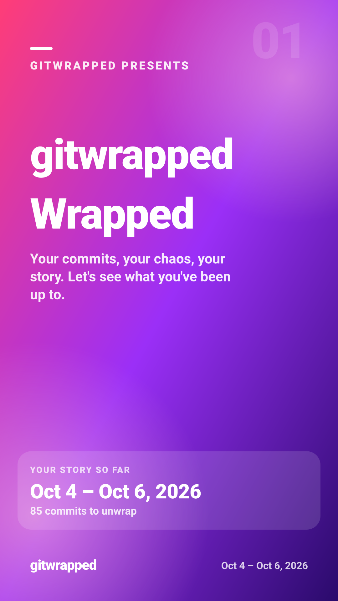
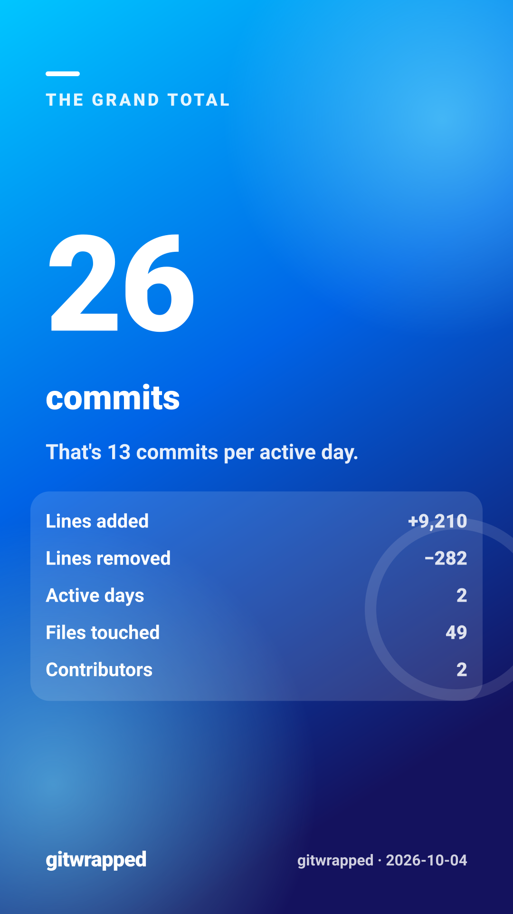
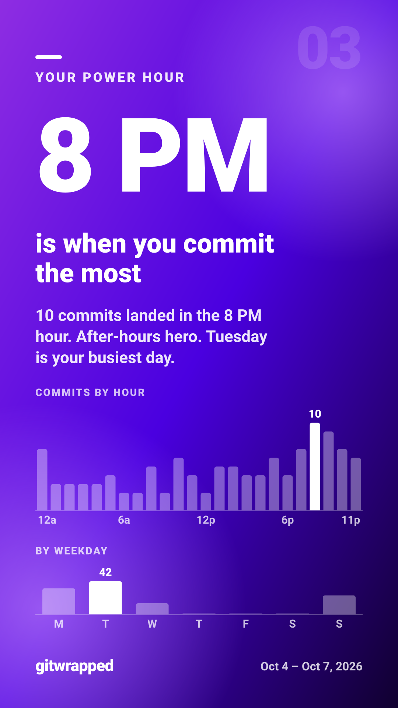
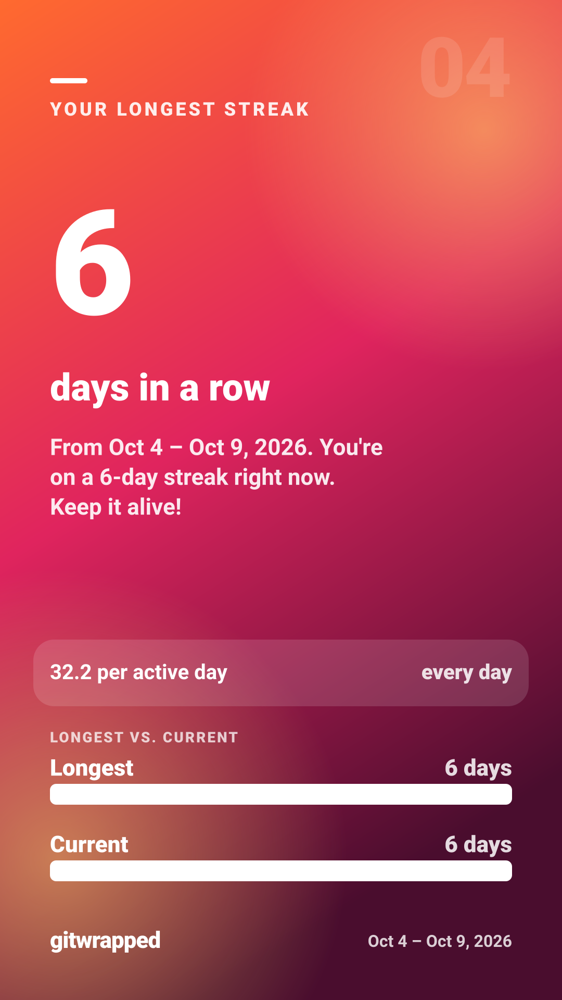
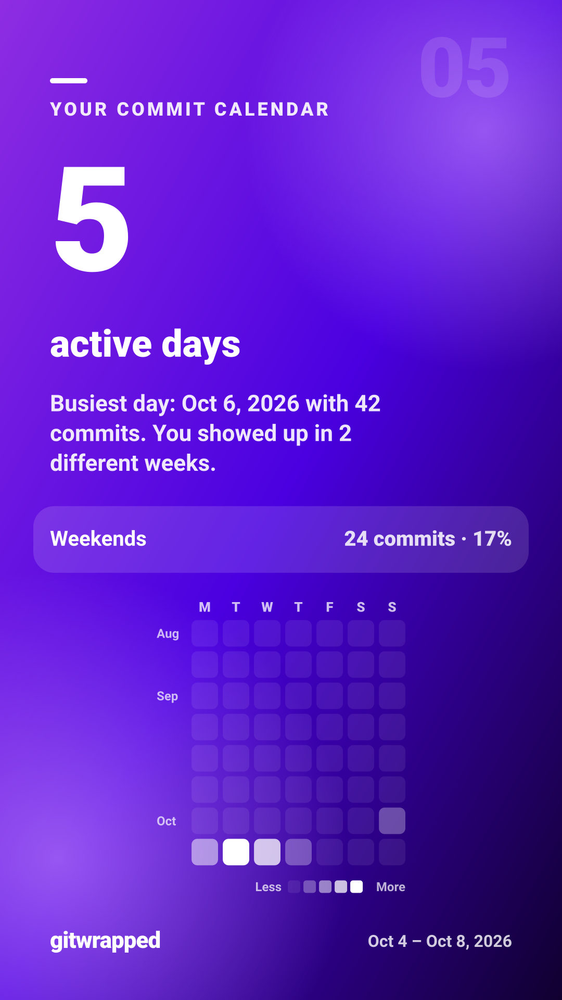
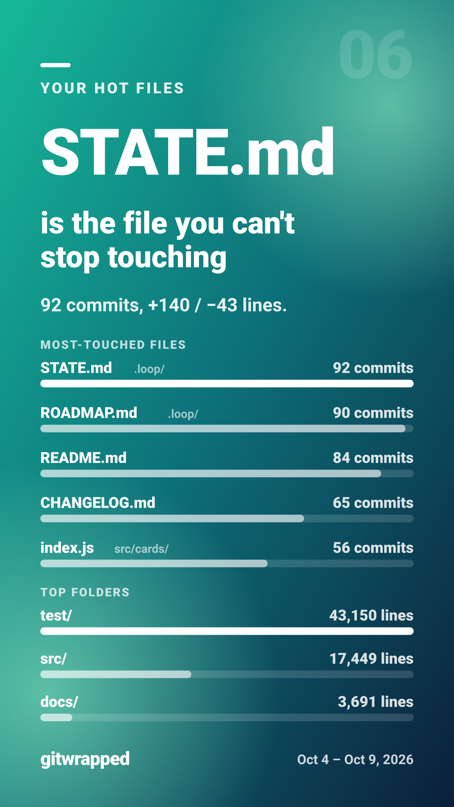
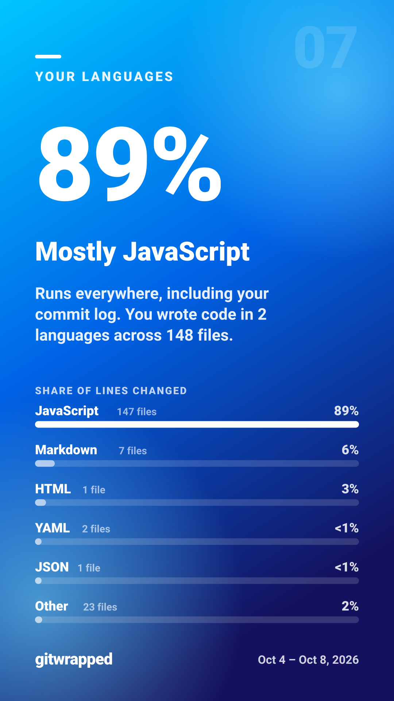
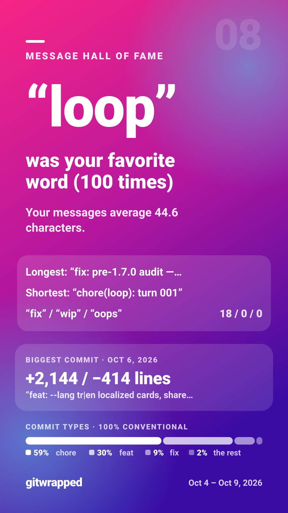
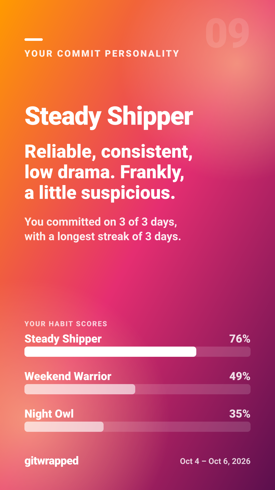
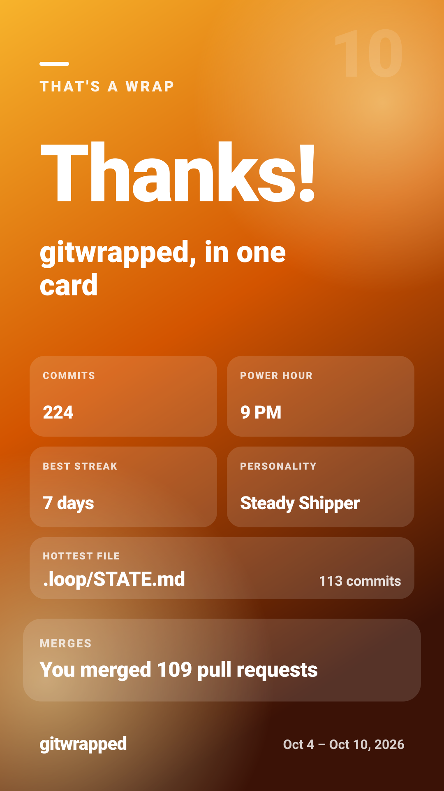

## Share image

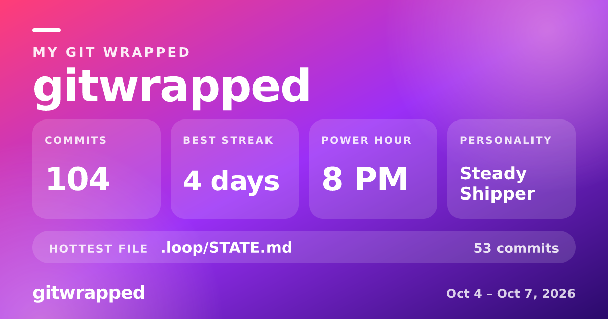

[`share.png`](share.png) is 1200x630, with an SVG copy in [`share.svg`](share.svg). The
per-card PNGs (`png/`) are gitignored to keep the repo small; `npm run self-wrapped`
writes them locally.
